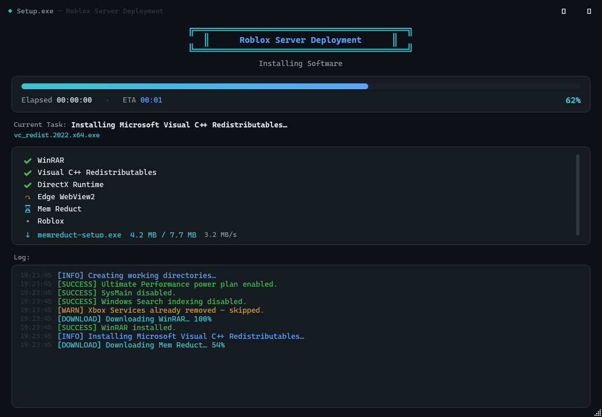
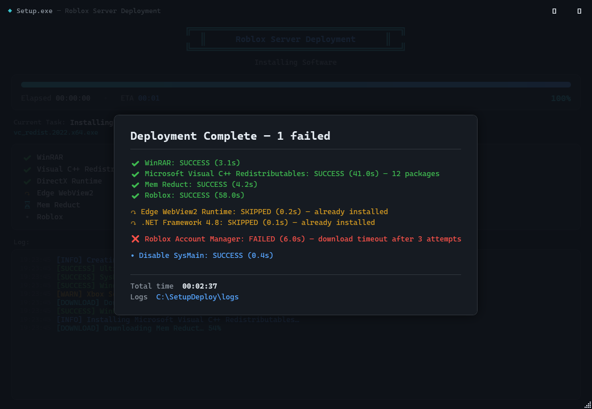

# Setup.exe — Roblox Server Deployment Tool

A professional, **one-click, fully unattended** Windows deployment application for a
dedicated **Tiny10 x64 23H2** machine. It optimizes Windows for performance,
silently installs a curated software stack, logs every action, and reports a full
summary at the end — all behind a premium **terminal-style** WPF interface.

> Built with **C# / .NET 8 / WPF**. Ships as a single `Setup.exe` that requires
> Administrator elevation and performs the entire deployment with **no user
> interaction** (the UAC prompt is the only pre-run step).

## Screenshots

Live deployment console:



Final summary screen:



> These are actual frames rendered from the compiled `MainWindow` (not mockups).

---

## Quick install (one-liner)

On the target machine, open **PowerShell** and run:

```powershell
irm https://raw.githubusercontent.com/xelasleepi/vps/main/install.ps1 | iex
```

This downloads the latest **self-contained** `Setup.exe` (no .NET install required)
from the GitHub release and launches it elevated — approve the single UAC prompt
and the deployment runs unattended. Edit [`config.json`](src/Setup/config.json)
in the release, or drop your own `config.json` next to the exe, to change toggles.

---

## Highlights

- **Terminal-style UI** — dark theme, monospace, Mica backdrop, rounded corners,
  live colored log, progress bar, elapsed/ETA, download speed, step checklist.
- **Silent & idempotent** — safe to run repeatedly; already-installed software is
  detected and skipped; no installer windows, no prompts, no message boxes
  (only the in-app final summary).
- **Resilient** — every operation reports `SUCCESS` / `FAILED` / `SKIPPED` with
  elapsed time; failures never abort the run, they are collected and reported.
- **Reusable download manager** — HTTPS, resume, retry (3×), SHA-256 verification,
  progress + speed, per-attempt timeouts.
- **Config-driven** — `config.json` controls features, URLs, silent switches and
  hashes without recompiling.
- **Comprehensive logging** — `install.log`, `errors.log`, `downloads.log`,
  `optimization.log`, `software.log`, all timestamped.

---

## What it does

### Windows optimization (`OptimizeWindows`)
Disables/adjusts: SysMain, Windows Search indexing, Delivery Optimization, Xbox
services, Xbox Game Bar, Game DVR, Hibernation, Fast Startup, Background Apps,
Consumer Experience, Windows Tips, Suggested Apps, Lock-screen suggestions,
Scheduled Maintenance, Scheduled Defrag, Startup Delay, Transparency, Visual
Effects, Automatic App Updates, Notification suggestions.

Configures: Ultimate Performance power plan (falls back to High Performance),
never sleep/hibernate/display-off, processor scheduling = background services,
USB selective suspend off, PCIe ASPM off.

Explorer: show file extensions, show hidden files, open **This PC**, disable
recent files & frequent folders.

Cleans: user Temp, Windows Temp, Prefetch, Windows Update cache (when appropriate).

### Software installation
| Software | Detection → skip if present | Source |
|---|---|---|
| WinRAR | `WinRAR.exe` / uninstall key | rarlab.com |
| Visual C++ Redistributables (2005–2022, x86 + x64) | registry / uninstall keys | Microsoft (aka.ms + download.microsoft.com) |
| .NET Framework 4.8 | `NDP\v4\Full` Release ≥ 528040 | Microsoft |
| .NET Desktop Runtime 8 | `dotnet --list-runtimes` / shared folder | Microsoft |
| Edge WebView2 Runtime | EdgeUpdate client `pv` | Microsoft (evergreen) |
| DirectX End-User Runtime (June 2010) | `d3dx9_43.dll` present | Microsoft |
| Mem Reduct | install path / uninstall key | github.com/henrypp |
| Roblox | `RobloxPlayerBeta.exe` under LocalAppData | roblox.com |
| Roblox Account Manager | extracted exe present | github.com/ic3w0lf22 |

**Mem Reduct** is additionally configured after install: launch with Windows,
start minimized to tray, automatic memory cleanup with sensible thresholds
(see `memReductSettings` in `config.json`).

---

## Requirements

- **Windows 10/11 x64** (target: Tiny10 x64 23H2).
- **.NET 8 Desktop Runtime** to run, **.NET 8 SDK** to build.
  (Ironically the tool can install the runtime itself; to bootstrap on a bare
  machine, publish self-contained — see below.)
- **Administrator** privileges (enforced by the embedded manifest).
- Internet access for downloads.

---

## Build

```powershell
# From the repository root
dotnet restore RobloxDeploy.sln
dotnet build   RobloxDeploy.sln -c Release
```

Output: `src/Setup/bin/Release/net8.0-windows/win-x64/Setup.exe`.

### Publish a portable, framework-dependent Setup.exe
```powershell
dotnet publish src/Setup/Setup.csproj -c Release -r win-x64 --self-contained false -o publish
```

### Publish a single self-contained Setup.exe (runs on a machine with no .NET)
```powershell
dotnet publish src/Setup/Setup.csproj -c Release -r win-x64 `
  --self-contained true -p:PublishSingleFile=true -o publish
```

Copy `config.json` next to the published `Setup.exe` (the build copies it to the
output folder automatically).

---

## Run

Right-click **Setup.exe → Run as administrator** (or just double-click — the
manifest triggers the UAC prompt). Everything after that is automatic.

Working folders are created next to the executable under `SetupDeploy\`:

```
SetupDeploy\
  downloads\   installer payloads
  logs\        install.log, errors.log, downloads.log, optimization.log, software.log
  temp\        scratch (DirectX payload, extracted archives)
```

Set `"workingDirectory"` in `config.json` to relocate them.

---

## Configuration (`config.json`)

Top-level toggles:

```jsonc
{
  "autoReboot": false,          // reboot 30s after completion
  "cleanupOnFinish": true,      // wipe downloads/temp at the end
  "continueOnError": true,
  "features": {
    "installWinRAR": true,
    "installVisualCpp": true,
    "installDotNet": true,
    "installWebView2": true,
    "installDirectX": true,
    "installMemReduct": true,
    "installRoblox": true,
    "installRobloxAccountManager": true,
    "optimizeWindows": true,
    "autoReboot": false
  },
  "downloads": { "maxRetries": 3, "timeoutSeconds": 900, "resumeIfPossible": true }
}
```

- Each entry under `software` has a `url`, optional `wingetId` (fallback),
  optional `sha256` (leave **empty** to skip verification — required for
  "evergreen" always-latest links whose bytes change over time),
  `installerFileName`, and `silentArgs`.
- To pin a version for reproducibility, set both a fixed `url` **and** its `sha256`.

---

## Architecture

Single WPF project (`src/Setup/Setup.csproj`, `AssemblyName=Setup`) organized as:

```
src/Setup/
  App.xaml / App.xaml.cs            composition root: config → logging → engine → UI
  MainWindow.xaml / .cs             terminal-style console window
  config.json                       deployment configuration
  app.manifest                      requireAdministrator + DPI + long paths
  Themes/                           Colors.xaml, Styles.xaml
  UI/
    ViewModels/                     MainViewModel (IProgressReporter), TerminalLine, TrackedItem
    Interop/WindowEffects.cs        Mica / dark title bar / rounded corners
    Converters/
  Core/
    Models/                         enums, results, config, download models
    Abstractions/                   ILogger, IDownloadManager, IProcessRunner,
                                    IProgressReporter, IInstaller, IOptimizationTask
    Services/                       Logger, DownloadManager, ProcessRunner
    Utils/                          AdminHelper, RegistryHelper, FileSystemUtil
    Installers/                     one class per package + InstallerCatalog
    Optimization/                   grouped tweak tasks + OptimizationCatalog
    Deployment/                     DeploymentContext, DeploymentEngine
```

**Flow:** `App` loads `config.json`, creates the working dirs + `Logger`, builds
the `DownloadManager` / `ProcessRunner`, creates the `MainViewModel` (which is the
UI's `IProgressReporter`), then runs `DeploymentEngine`. The engine applies the
optimization tasks, runs the installers in dependency order (runtimes before
apps), cleans up, and returns a `DeploymentSummary` that the view-model renders on
the final screen.

Everything is decoupled through interfaces and a single `DeploymentContext`, so
installers and optimization tasks are independently testable and the module
boundaries stay clean.

---

## Notes & caveats

- **Roblox** and **Roblox Account Manager** install into the current (elevated)
  user's profile — expected for a dedicated single-user box.
- **HKCU** optimizations apply to the elevated user's hive; on a single-user Tiny10
  machine this is the intended account.
- Some services (Xbox, Search) may already be removed on Tiny10 — those steps
  report **SKIPPED**, not failed.
- Evergreen download URLs (VC++ `aka.ms`, WebView2, Edge) intentionally omit
  `sha256`. Pin a version + hash if you need reproducible, verified installs.

---

## License / attribution

Third-party software is downloaded from official vendor sources at runtime and is
subject to its own licenses (WinRAR, Microsoft redistributables, Mem Reduct,
Roblox, Roblox Account Manager).
